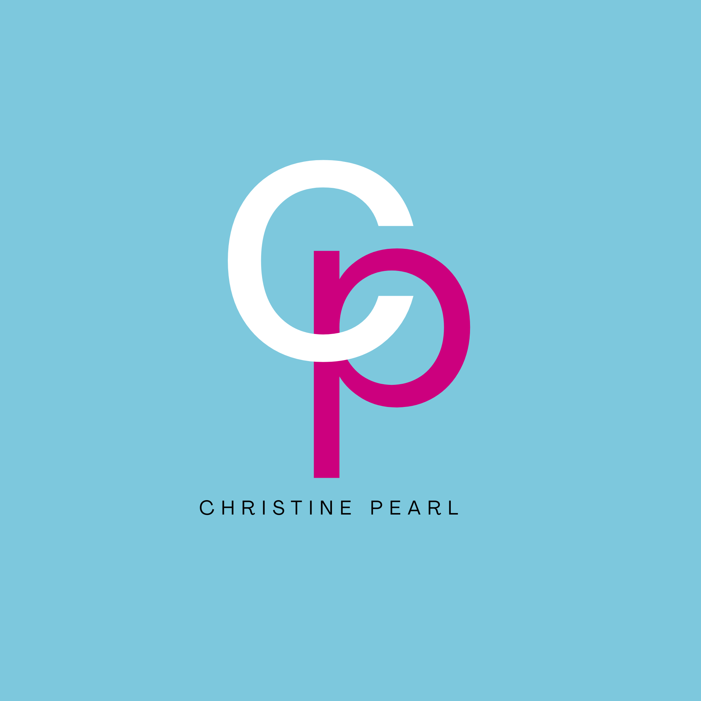

# GE-IT-Skills-portfolio
## Professional Bio

Hello everyone! I am Christine Pearl P. Suson, an aspiring Social Media Specialist with strengths in creative thinking and multimedia editing. I am passionate about creating engaging digital content and staying updated on digital trends and online culture.

> **"Translating trends into engagement."** 

---

## Project Showcase

### Project 1: Branding

<!-- Requirement 2: Embedded image using a relative file path -->

 

 

[Visit my Personal Portfolio Link](https://canva.link/29vvwug4st81rgj)

#### Design Reflection

<!-- Requirement 3: 2-3 sentence reflection -->

This project was designed to reflect my personal brand as an aspiring Social Media Specialist by combining creativity, professionalism, and a strong visual identity. I used a bold color palette, clean typography, and minimalist layouts to create an engaging yet organized presentation that highlights my skills, interests, and career goals. 

---

### Project 2: Visuals

<!-- Requirement 2: Embedded image using a relative file path -->

#### Design Reflection

<!-- Requirement 3: 2-3 sentence reflection -->

For this project, I used a bold color palette to reflect the energetic and dynamic nature of K-pop culture. I organized the content into a four-section grid layout with consistent icons, typography, and spacing to make the information easy to read and visually balanced. 

---

### Project 3: Docs

<!-- Requirement 2: Embedded image using a relative file path -->

#### Design Reflection

<!-- Requirement 3: 2-3 sentence reflection -->

For this project, I combined bold colors, rounded shapes, and visual icons to make the research findings more engaging and accessible to viewers. I structured the content in a clear top-to-bottom flow, allowing readers to easily follow the study from the introduction to the conclusion.

---

### Project 4: Media

<!-- Requirement 2: Embedded image using a relative file path -->
* [Visit my Personal Introduction Video](https://canva.link/gt2t0exi90bxh3j)
* [Visit my Prototype Link](https://canva.link/7z2nt6yijclqf5i)

#### Design Reflection

For this project, I focused on creating a modern and visually engaging interface that reflects the vibrant energy and style of K-pop culture. I incorporated bold imagery, consistent typography, and a well-structured layout to make product discovery more intuitive and enjoyable for users. For the personal video introduction, I utilized a bold color palette, smooth transitions from the intro to the outro, dynamic text effects, and a minimal design approach to create a visually cohesive and memorable presentation.

